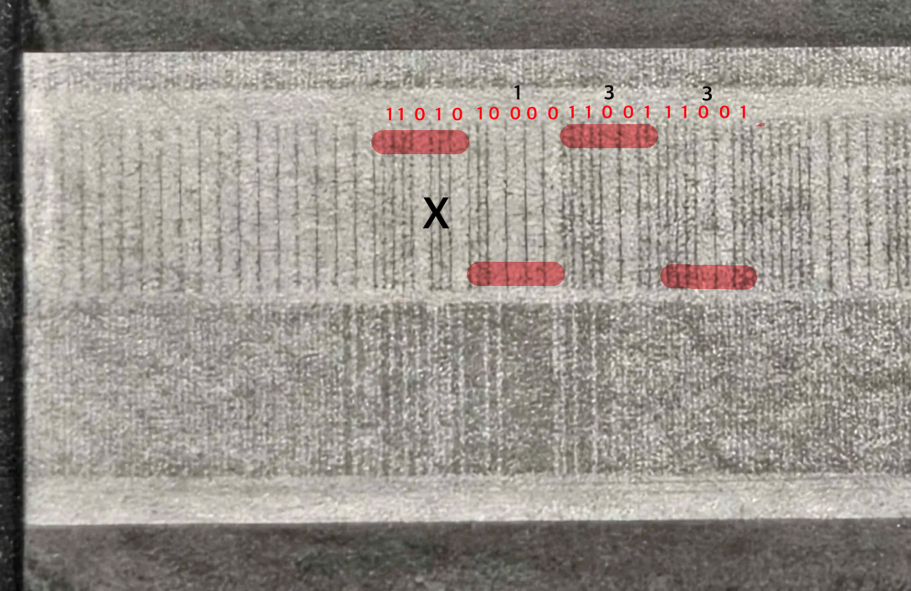

### A Few Words First

It was an amazing experience participating in the Raymond James CTF 2024 in Florida as a member of our JHU CTF team @Z0D1AC. The games were a blast, especially the first physical challenge that really pushed us to think outside the box. We also tackled some super interesting challenges, like Lego-building, lockpicking, and drone tasks. Thanks to everyone’s efforts, we ended up securing 2nd place! 

Check out the news from JHU website!
[Johns Hopkins student team places second in Raymond James cybersecurity competition - JHU Information Security Institute](https://isi.jhu.edu/2024/10/17/johns-hopkins-student-team-places-second-in-raymond-james-cybersecurity-competition/)

### Now Let’s Dive Into Swipe Card Challenge

At the beginning, we were provided with a box, which had pencil, notebook, steel nail, whetstone, glow stick and some candies(?) in it, as well as a black swipe card without any printed card number on it. The flag is the card number. The easiest way to get it is through a card reader, but none of the teams have it. So be sure to carry your own card reader to your next ctf competition - just joking ;)

How to find number from a smooth interface? We tried several approaches, like scratching and lighting the surface. After some research, we found the information was encoded directly within the magnetic stripe itself. There is [an interesting article](https://www.abc.net.au/science/articles/2013/02/27/3699259.htm) about this. 

We filed iron filings from the nail and sprinkling them over the magnetic strip. Tilted the card and gently tapped. Then collected the fillings and do it again. After several attempts, we were excited that some iron filings were stick to the magnetic strip, which formed the shape of barcode.

We flipped the card upside down (180 degrees). The revealed barcode looks like this. 

### Barcode Decode

Next task is read barcode. Since there was no available tools for us, we decided to read one by one. 

The card number information is located in the Track2 (upper line in picture) . We read it five bit a number, the fifth bit is odd parity bit, so we only need to caculate four bits. The logic is pretty simple: if two strips has space between them, then it is 0; otherwise it’s 1.

For example, 10000 → 1, 11001 → 3. Then we got the first three card numbers is 133.

First 5 bits(11010) is a fixed value, not an actual card number, so we ignore it.

The range of valid card numbers is shown by a white rectangle. After we read all bits and calculate them all, we successfully recovered card number.

[magspoof](https://github.com/samyk/magspoof) This tool helped me a lot in understanding barcode works in magnetic strip.

